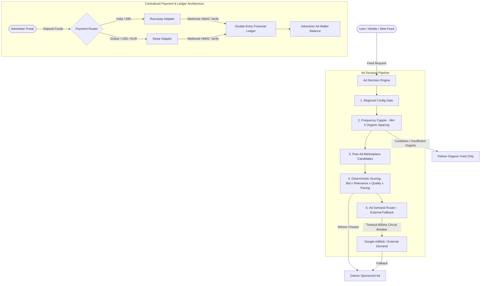

# Peto Global Monetization Architecture

This document details the complete end-to-end implementation of **Global Monetization** for the Peto social platform, spanning Database, Backend, Admin Panel, Web User Frontend, and Mobile (Flutter) applications.

---

## 1. Architectural Highlights

---

## 2. Centralized Regional Configuration

Located at:
- **Database**: `docs/database/19_regional_monetization_config.sql` (`regional_configs` table)
- **Backend**: `backend/src/regions/` (`regional.service.ts`, `regional.controller.ts`, `regional.routes.ts`)
- **Admin UI**: `admin/src/pages/AdminRegions.tsx`

### Capabilities
1. **Dynamic Country Resolution**: Extracts country codes from headers (`CF-IPCountry`, `X-Country-Code`) with fallback to `GLOBAL`.
2. **In-Memory Cache**: 60-second TTL cache for zero-latency lookups on feed requests.
3. **Admin Control Matrix**: One-click toggling of:
   - `ads_enabled`
   - `payments_enabled`
   - `advertiser_registration_enabled`
   - Primary currency and secondary accepted currencies
   - Payment provider preferences (`STRIPE`, `RAZORPAY`)
   - External ad networks and frequency cap overrides.

---

## 3. Centralized Payment & Double-Entry Ledger Service

Located at:
- **Database**: `docs/database/20_payment_architecture.sql`
- **Backend**: `backend/src/payments/` (`payment.service.ts`, `payment.router.ts`, `adapters/stripe.adapter.ts`, `adapters/razorpay.adapter.ts`)
- **Admin UI**: `admin/src/pages/AdminPayments.tsx`

### Key Features
1. **PCI-DSS Compliance**: No raw credit card PAN or CVV numbers are stored. Tokenized identifiers only.
2. **Double-Entry Ledger**: Every fund addition and ad spend deduction creates an immutable record in `payment_ledger` tracking `balance_before` and `balance_after`.
3. **Idempotency**: All payment session initializations require an `idempotencyKey` preventing duplicate charges.
4. **HMAC Webhook Protection**: Cryptographic signature validation for Stripe (`stripe-signature`) and Razorpay (`X-Razorpay-Signature`), with replay attack protection.
5. **Refunds**: Admin-initiated partial and full refunds with automated ledger adjustments.

---

## 4. Advertiser Account & Ad Marketplace

Located at:
- **Backend**: `backend/src/advertisers/` (`advertiser.service.ts`, `advertiser.controller.ts`)
- **Web Frontend**: `Frontend/Peto_user/src/pages/advertiser/AdvertiserPortal.tsx` (`/advertiser`)

### Advertiser Portal Features
1. **Onboarding & Verification**: Business registration requiring industry, official website, billing email, and Tax/VAT ID.
2. **Campaign Creation Wizard**:
   - **Step 1 (Objectives & Budget)**: Brand Awareness, Traffic, Conversions, App Installs with Daily and Lifetime caps.
   - **Step 2 (Audience Targeting)**: Targeting by pet type (`DOG`, `CAT`, `BIRD`, `REPTILE`, `SMALL_PET`), countries, and user interests.
   - **Step 3 (Creative Asset)**: Headline, body text, CTA button, media asset preview, destination URL.
   - **Mandatory Review**: All submitted campaigns enter `PENDING_REVIEW` status; no direct activation without compliance check.
3. **Live In-Feed Preview**: Real-time interactive simulation of the ad as it will look in user feeds.
4. **Billing & Top-Up Modal**: Instant wallet replenishment with localized payment checkout redirection.

---

## 5. Ad Decision Engine & External Demand Router

Located at:
- **Backend**: `backend/src/ads/engine/` (`adDecisionEngine.ts`, `frequencyCapper.ts`)
- **External Adapters**: `backend/src/ads/external/` (`admob.adapter.ts`, `adDemandRouter.ts`)

### Pipeline Sequence
1. **Region & Feature Check**: Validates if advertising is enabled in the user's country.
2. **Frequency Capping**:
   - Requires at least 5 organic posts between any two sponsored posts.
   - Sliding-window cooldown: Max 4 ads per session.
3. **Peto Marketplace Scoring**:
   $$\text{Score} = \text{Bid} \times \text{Relevance} \times \text{Quality} \times \text{Pacing}$$
   - High relevance multiplier when post pet type matches user's active pets.
   - Budget pacing multiplier prevents campaigns from burning budgets prematurely.
4. **External Demand Fallback**:
   - If no Peto marketplace ads qualify or clear the floor bid, the `AdDemandRouter` queries Google AdMob.
   - Circuit-breaker with 800ms hard timeout ensures feed loading is never delayed.
   - If both fail, organic feed is served seamlessly.

---

## 6. User Ad Transparency & Controls

Located at:
- **Web**: `Frontend/Peto_user/src/components/social/SponsoredPostCard.tsx`
- **Mobile**: `Mobile/peto_user/lib/widgets/sponsored_post_card.dart`

### User Controls
- **Sponsored Badge**: Transparent indication of paid promotional partner content.
- **Why am I seeing this ad?**: Explains targeting factors (pet care interest, approximate country, demographic standards).
- **Hide this ad**: Instantly hides the ad with an "Undo" option, saving user preferences via `POST /api/ads/:id/feedback`.
- **Report ad**: User report modal with categories (Misleading/Scam, Inappropriate, Animal Welfare concern) directly feeding into moderation queues.
